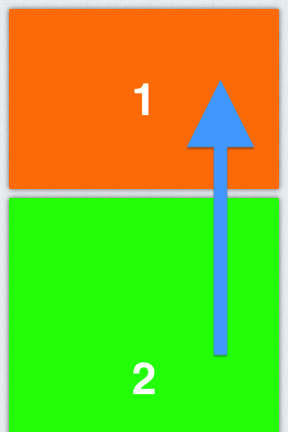

# GTScrollViewController

You need a table but with the dynamic view like Facebook home?

GTScrollView allows you to dynamically add unlimited views.
Every view will be placed correctly in order after the last view added.

## Usage
Include in your project the classe:
`#import "GTScrollViewController.h"`

Now create your `GTScrollView` and add your custom view:

	GTScrollViewController *scroller = [[GTScrollViewController alloc] init:nil]; 

    [scroller addViews:[[NSArray alloc] initWithObjects:first,second,... nil]]; 

or init `GTScrollView` with the `NSArray` of your custom view:

    GTScrollViewController *scroller = [[GTScrollViewController alloc] init: [[NSArray alloc] initWithObjects:first,second,... nil]];

	[scroller addViews:[[NSArray alloc] initWithObjects:first,second,... nil]]; 

or init `GTScrollView` with the `NSArray` of your custom view:

	GTScrollViewController *scroller = [[GTScrollViewController alloc] init: [[NSArray alloc] initWithObjects:first,second,... nil]];

That's it, really!

## Feature
For now, these methods are available:

	-(id)init:(NSArray *)views;
	-(id)init:(NSArray *)views andPaddingTopBottom:(float)padTB;
	-(void)setBackgroundImage:(UIImage*) image;
	-(void)addView:(UIView *)view;
	-(void)addViews:(NSArray *)views;
	-(void)setShadowRadius:(float)sr shadowOpacity:(float)so andCornerRadius:(float)cr;

#### Init method passing array of view and padding
	-(id)init:(NSArray *)views andPaddingTopBottom:(float)padTB;
#### Set the background image
	-(void)setBackgroundImage:(UIImage*) image;
#### Add single view
	-(void)addView:(UIView *)view;
#### Add array of view
	-(void)addViews:(NSArray *)views;
#### Set shadow and corner property
	-(void)setShadowRadius:(float)sr shadowOpacity:(float)so andCornerRadius:(float)cr;

### Restore default value for shadow and radius
	-(void)restoreShadowRadiusOpacityAndCornerRadius;

## Dependencies
QuartzCore framework is require.
## Demo
Play with it and ask me whatever you want.

## Contact
Gianluca Tursi
- (http://www.gianlucatursi.com)[http://www.gianlucatursi.com]
- (http://twitter.com/gianlucatursi)[http://twitter.com/gianlucatursi]
- (gian.tursi@gmail.com)[mailto:gian.tursi@gmail.com]
- (info@gianlucatursi.com)[mailto:info@gianlucatursi.com]